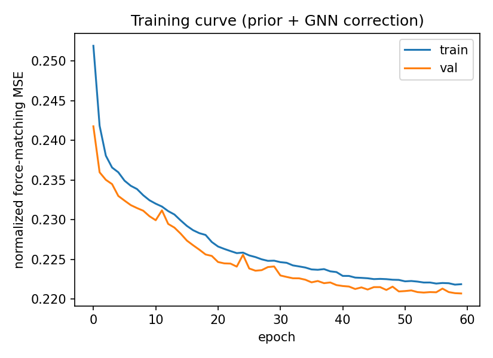
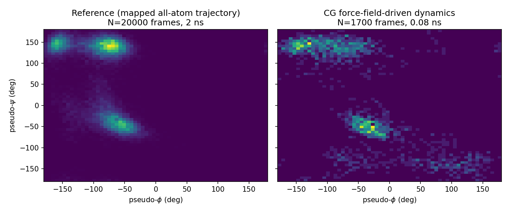

# Machine-Learned Coarse-Grained Force Field for Alanine Dipeptide

[](https://github.com/annemcq/mlcg-gnn-alanine/actions/workflows/tests.yml)

This project explores force matching with a graph neural network to build a coarse-grained model of alanine dipeptide.

The model learns a coarse-grained energy function from an all-atom molecular dynamics trajectory. Forces are obtained as gradients of the learned energy and the resulting force field is used to run coarse-grained Langevin dynamics.

The implementation is based on ideas from CGnet and CGSchNet (Wang et al., 2019; Husic et al., 2020).

## System

The system is alanine dipeptide (ACE-ALA-NME), a small benchmark commonly used for testing molecular simulation and coarse-graining methods.

A 2 ns all-atom reference trajectory was generated at 300 K using OpenMM with the Amber ff14SB force field and GBn2 implicit solvent. Positions and forces were saved every 100 fs, giving 20,000 configurations.

The atomistic system is mapped to five coarse-grained beads:

```text
C_ACE — N_ALA — CA_ALA — C_ALA — N_NME
```

Each bead position is defined using the center of mass of its corresponding atom group, and the CG force is obtained by summing the atomic forces within that group.

The mapping was also checked by comparing the backbone dihedral angles calculated from the atomistic and CG representations. The phi cos/sin correlations were 0.961/0.910 and the psi correlations were 0.987/0.922; the mean absolute phi deviation was 9.6 degrees.

## Model

The learned potential is based on a small SchNet-style graph neural network.

For each configuration, the five CG beads form a fully connected graph. Pairwise distances are expanded using Gaussian radial basis functions and processed through continuous-filter interaction blocks.

The network predicts a scalar energy

$$
U_{\mathrm{GNN}}(R)
$$

and the corresponding forces are calculated using automatic differentiation:

$$
F_i = -\frac{\partial U}{\partial R_i}
$$

Because the energy depends on pairwise distances, it is invariant to global translation and rotation.

## Harmonic prior

An initial version used the GNN alone. The earlier claim that its dynamics ran away was not reproduced: three 5,000-step runs stayed near the reference extent, and a later 100,000-step check also kept bond lengths in the reference range. The reason to keep the bonded prior should instead be tested through the conformational distribution, not an unverified instability story.

To constrain these degrees of freedom, the final model includes a harmonic prior on consecutive CG beads:

$$
U_{\mathrm{prior}} =
\sum_{(i,j)}
\frac{1}{2} k_{ij}(d_{ij}-d_{ij}^{0})^2
$$

The equilibrium distances and force constants are estimated from the bond-length statistics of the mapped reference data.

The final energy is

$$
U(R) = U_{\mathrm{prior}}(R) + U_{\mathrm{GNN}}(R)
$$

so the harmonic term maintains the bonded structure while the GNN learns the remaining correction.

## Training

The model is trained by force matching against the mapped forces from the atomistic trajectory.

The dataset is split into training and validation sets, and the GNN correction is optimized using Adam. The harmonic prior is fitted from the mapped reference configurations and remains fixed during optimization.

The training script saves the learned GNN weights, prior parameters, mapped CG dataset, dihedral validation data and training history.



## CG simulation

The trained force field is used to run Langevin dynamics with a BAOAB-style integrator implemented in `src/cg_dynamics.py`.

The main validation compares the conformational distribution sampled by the learned CG model with the distribution obtained from the reference trajectory.



The CG dynamics samples the main conformational regions of the reference trajectory in approximately the same areas of pseudo-phi/psi space. However, the relative populations and overall distribution are not reproduced well: the CG trajectory is more diffuse and also visits regions that are only sparsely populated in the reference data. A quantitative comparison of the 2D phi/psi histograms gives a Jensen-Shannon divergence of 0.4634 bits (36 bins per angle) between the mapped reference trajectory and the learned CG dynamics. The reference half-vs-half JSD is 0.0209 bits, while two independent 1,700-frame reference subsamples give 0.0784 bits; the CG-vs-reference difference is therefore about 5.9× larger than the latter finite-sample baseline. The three CG runs contribute 14,100 post-burn-in frames in total, and their mismatch is much larger than the reference subsampling baseline. The result should be interpreted as evidence that the learned model does not reproduce the reference conformational populations quantitatively, despite sampling the same broad regions.

This suggests that the learned energy surface is not well constrained outside the configurations represented in the training trajectory.

## What I learned

This project showed that a decreasing force-matching loss is not enough to establish whether the learned model reproduces the reference conformational distribution.

A three-seed 5,000-step test of the GNN-only model does not reproduce the earlier instability claim: the maximum absolute bead displacement was 0.299, 0.308, and 0.294 nm for seeds 1–3, respectively, compared with an expected extent of roughly ±0.3 nm around the center of mass. A preliminary distribution check gave JSD around 0.71 bits for GNN-only versus 0.46 bits for prior + GNN against the mapped reference. However, the GNN-only model was trained for 15 epochs and the correction for 60, so this is **not a controlled comparison**; an equal-epoch, multi-seed experiment is still needed before attributing the difference to the prior.

The final model's conformational distribution also shows that geometrically well-behaved dynamics are not enough. Sampling regions that are poorly represented in the training data remains a problem.

For this small system, possible next steps would include longer or more diverse reference sampling, additional physically motivated priors, and validation over longer CG trajectories and additional random seeds.

## Repository structure

```text
mlcg-gnn-alanine/
├── data/
│   ├── alanine-dipeptide.pdb
│   ├── aa_positions_nm.npy
│   ├── aa_forces_kjmolnm.npy
│   ├── cg_positions_nm.npy
│   ├── cg_forces_kjmolnm.npy
│   ├── cgnet_correction_state.pt
│   └── prior_params.pt
│
├── src/
│   ├── cg_mapping.py
│   ├── cg_gnn_model.py
│   ├── cg_dataset.py
│   └── cg_dynamics.py
│
├── scripts/
│   ├── 01_generate_reference_trajectory.py
│   ├── 02_train_cgnet.py
│   └── 03_compare_conformational_distributions.py
│
├── notebooks/
│   └── 03_train_and_validate_cgnet.ipynb
│
├── results/
│   ├── figures/
│   │   ├── training_curve.png
│   │   └── ramachandran_comparison.png
│   └── conformational_distribution_comparison.csv
│
├── tests/
│   └── test_cg_model.py
│
├── environment.yml
├── pytest.ini
└── README.md
```

## Reproducing the project

Create the Conda environment:

```bash
conda env create -f environment.yml
conda activate mlcg-gnn-alanine
```

Generate the all-atom reference trajectory:

```bash
python scripts/01_generate_reference_trajectory.py
```

Map the trajectory and train the CG model:

```bash
python scripts/02_train_cgnet.py
```

Run the validation notebook:

```bash
jupyter nbconvert --to notebook --execute --inplace notebooks/03_train_and_validate_cgnet.ipynb
```

Run the tests:

```bash
pytest tests/
```

The generated trajectory and trained model artifacts are also included in the repository, so the existing results can be inspected without rerunning the complete training pipeline.

## Tests

The test suite checks several properties of the implementation:

- translation invariance of the learned energy
- rotation invariance of the learned energy
- consistency between forces and the negative energy gradient
- fitting of the harmonic prior
- combination of prior and GNN energies
- consistent energy/force scaling
- calculation of a known dihedral geometry
- reproducibility of Langevin dynamics for a fixed random seed

The tests do not require OpenMM or regeneration of the reference trajectory.

## Limitations

Alanine dipeptide is a very small benchmark system, so the model should not be interpreted as evidence that the same architecture would work without modification for larger molecular systems.

The reference trajectory is also relatively short. As a result, some regions of conformational space are only sparsely represented, which limits how well the learned potential can be constrained outside the sampled configurations.

Finally, the CG representation contains only five beads and uses a simple harmonic bonded prior. More complex systems would require a richer treatment of bonded interactions and molecular topology.

## Tools

Python, PyTorch, OpenMM, NumPy and matplotlib.

## Related projects

- [CG Force Field API](https://github.com/annemcq/cgnet-api) — interactive deployment of the trained coarse-grained force field.
- [Free Energy: MBAR & Zwanzig](https://github.com/annemcq/free-energy-mbar-zwanzig) — a separate project applying statistical-mechanics free-energy estimators to umbrella-sampling data.

## License

This project is available under the MIT License.
